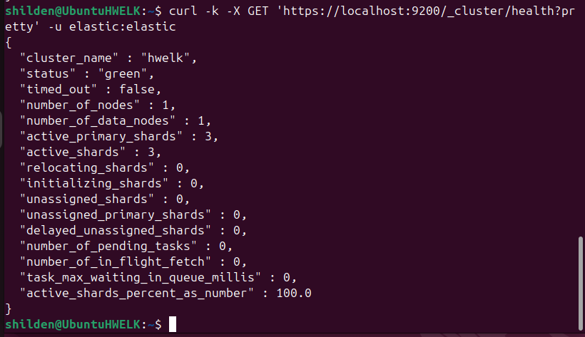
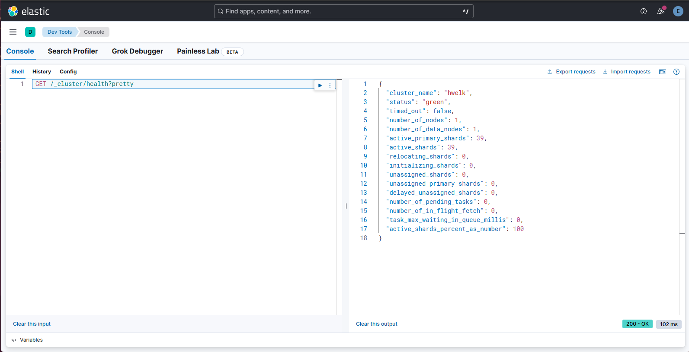
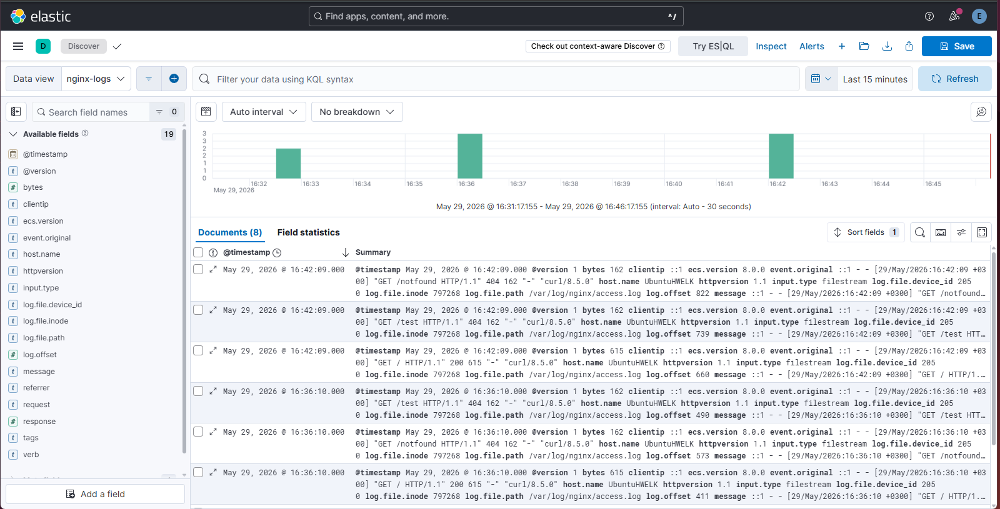
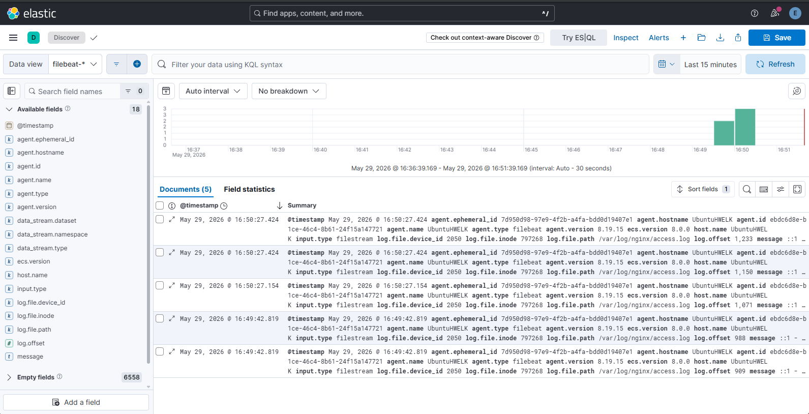

# Домашнее задание к занятию «ELK»
---
### Задание 1. Elasticsearch 

Установите и запустите Elasticsearch, после чего поменяйте параметр cluster_name на случайный. 

*Приведите скриншот команды 'curl -X GET 'localhost:9200/_cluster/health?pretty', сделанной на сервере с установленным Elasticsearch. Где будет виден нестандартный cluster_name*.

---

### Задание 2. Kibana

Установите и запустите Kibana.

*Приведите скриншот интерфейса Kibana на странице http://<ip вашего сервера>:5601/app/dev_tools#/console, где будет выполнен запрос GET /_cluster/health?pretty*.

---

### Задание 3. Logstash

Установите и запустите Logstash и Nginx. С помощью Logstash отправьте access-лог Nginx в Elasticsearch. 

*Приведите скриншот интерфейса Kibana, на котором видны логи Nginx.*

---

### Задание 4. Filebeat. 

Установите и запустите Filebeat. Переключите поставку логов Nginx с Logstash на Filebeat. 

*Приведите скриншот интерфейса Kibana, на котором видны логи Nginx, которые были отправлены через Filebeat.*

---

---

<h2 align="center">Решение</h2>

---

### Задание 1. Elasticsearch

*   Установлен Elasticsearch версии `8.19.16`.
*   Изменён параметр `cluster_name` на `hwelk`.

# Скриншот результата (видно нестандартное имя hwelk):

---

### Задание 2. Kibana

- Установлена Kibana версии 8.19.15.
- Настроено подключение к Elasticsearch через сервисный аккаунт.
- Веб-интерфейс доступен по адресу: http://192.168.0.178:5601

Скриншот интерфейса Kibana (Dev Tools) с выполненным запросом:

---

### Задание 3. Logstash

- Установлены Nginx и Logstash версии 8.19.15.
- Создан конфигурационный файл Logstash для парсинга access.log Nginx.
- Логи Nginx успешно отправлены в Elasticsearch через Logstash.

Скриншот интерфейса Kibana, на котором видны логи Nginx (индекс logstash-nginx-*):

---

### Задание 4. Filebeat. 

- Установлен Filebeat версии 8.19.15.
- Произведено переключение поставки логов Nginx с Logstash на прямую отправку в Elasticsearch через Filebeat.
- Логи Nginx успешно отправлены в Elasticsearch напрямую.

Скриншот интерфейса Kibana, на котором видны логи Nginx, отправленные через Filebeat (индекс filebeat-*):

---

<h2 align="center">Вывод</h2>

В результате выполнения домашнего задания:
- Был развёрнут и настроен кластер Elasticsearch с нестандартным именем.
- Установлена и подключена к кластеру Kibana для визуализации и управления.
- Настроен Logstash для парсинга access-логов Nginx и их отправки в Elasticsearch.
- Настроен Filebeat для отправки логов Nginx напрямую в Elasticsearch, минуя Logstash.

Все сервисы работают стабильно, логи успешно доставляются и отображаются в Kibana.

---
